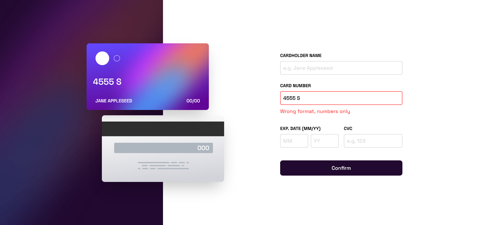

# Frontend Mentor - Interactive card details form solution

This is a solution to the [Interactive card details form challenge on Frontend Mentor](https://www.frontendmentor.io/challenges/interactive-card-details-form-XpS8cKZDWw). Frontend Mentor challenges help you improve your coding skills by building realistic projects. 

## Table of contents

- [Overview](#overview)
  - [The challenge](#the-challenge)
  - [Screenshot](#screenshot)
  - [Links](#links)
- [My process](#my-process)
  - [Built with](#built-with)
  - [What I learned](#what-i-learned)
  - [Useful resources](#useful-resources)
- [Author](#author)

## Overview

### The challenge

Users should be able to:

- Fill in the form and see the card details update in real-time
- Receive error messages when the form is submitted if:
  - Any input field is empty
  - The card number, expiry date, or CVC fields are in the wrong format
- View the optimal layout depending on their device's screen size
- See hover, active, and focus states for interactive elements on the page

### Screenshot

### Links

- Solution URL: [On Github](https://github.com/vaibhavbshete/frontend-mentor-challenges/tree/main/interactive-card-details-form)
- Live Site URL: [On Github Pages](https://vaibhavbshete.github.io/frontend-mentor-challenges/interactive-card-details-form/)

## My process

### Built with

- Semantic HTML5 markup
- Mobile-first workflow
- [Tailwind](https://tailwindcss.com) - CSS Framework
- [Vue](https://vuejs.org/) - JS library

### What I learned

I have made a bold decision to auto-format the card number as the user types. Vue bindings helped a lot with this one.
Got a bit more familiar with Regular Expressions while achieving this.

### Useful resources
- [RegEx101](https://regex101.com) - This helped me build and test my regular expressions. Very handy tool. Gives detailed explanation about *why* a particular thing was matched.

## Author

- Website - [My Submissions to FrontendMentor](https://vaibhavbshete.github.io/frontend-mentor-challenges/index.html)
- Frontend Mentor - [@vaibhavbshete](https://www.frontendmentor.io/profile/vaibhavbshete)
- Twitter - [@vaibhavbshete](https://www.twitter.com/vaibhavbhsete)
