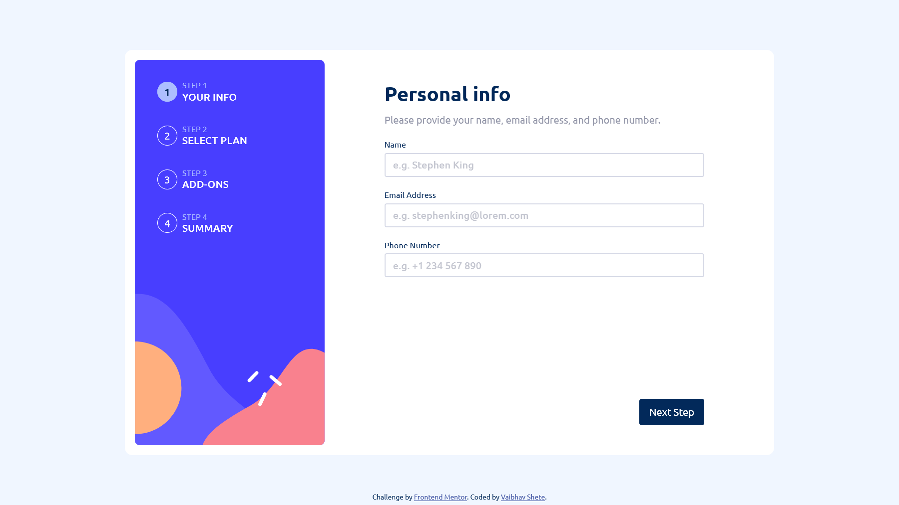

# Frontend Mentor - Multi-step form solution <!-- omit in toc -->

This is a solution to the [Multi-step form challenge on Frontend Mentor](https://www.frontendmentor.io/challenges/multistep-form-YVAnSdqQBJ). Frontend Mentor challenges help you improve your coding skills by building realistic projects. 

## Table of contents <!-- omit in toc -->

- [Overview](#overview)
  - [The challenge](#the-challenge)
  - [Given Styleguide](#given-styleguide)
  - [Screenshot](#screenshot)
  - [Links](#links)
- [My process](#my-process)
  - [Built with](#built-with)
  - [What I learned](#what-i-learned)
  - [Continued development](#continued-development)
  - [Useful resources](#useful-resources)
- [Author](#author)

## Overview

### The challenge

Users should be able to:

- Complete each step of the sequence
- See a summary of their selections on the final step and confirm their order
- View the optimal layout for the interface depending on their device's screen size
- See hover and focus states for all interactive elements on the page

### Given Styleguide
[Style Guide](./style-guide.md)

### Screenshot

### Links

- [Solution](https://github.com/vaibhavbshete/frontend-mentor-challenges/tree/main/multi-step-form)
- [Live Site](https://vaibhavbshete.github.io/frontend-mentor-challenges/multi-step-form/)

## My process

### Built with

- Semantic HTML5 markup
- Mobile-first workflow
- CSS custom properties
- [Webpack](https://webpack.js.org/) - Bundler
- [React](https://react.dev/) - JS library

### What I learned

The major thing I learned was React. And its webpack setup. I had used React before, and I had used webpack inside laravel-mix before, but hadn't truly understood what defaults it used and what I did or did not actually need.

### Continued development

I'm definitely going to use React more. I still like some aspects of Vue more, for sure. But most of the jobs I searched for require React and I had been feeling left out. Not anymore!

I have already started using it in some of my paid projects.

### Useful resources

 - [react.dev](https://react.dev) - This is a complete makeover of their previous documentation at https://reactjs.org and it is very much user-friendly, and beginner-friendly.
- [Webpack Docs](https://webpack.js.org/concepts/) - Though still has an old-school look, it is very comprehensive.
- [ChatGPT](https://chat.openai.com) - THIS has been the definitive tool that made me take the leap. I can ask very specific questions even in a frustrated tone, and it answers very well. The other two resources seem to assume that we already have a problem to solve and offer their solution. If you don't understand the problem, it is of little help. But ChatGPT tries to understand where you stand and provides necessary context for you to understand a concept.

## Author

- Website - [Vaibhav Shete](https://vaibhavbshete.github.io)
- Frontend Mentor - [@vaibhavbshete](https://www.frontendmentor.io/profile/vaibhavbshete)
- Twitter - [@vaibhavbshete](https://www.twitter.com/vaibhavbshete)