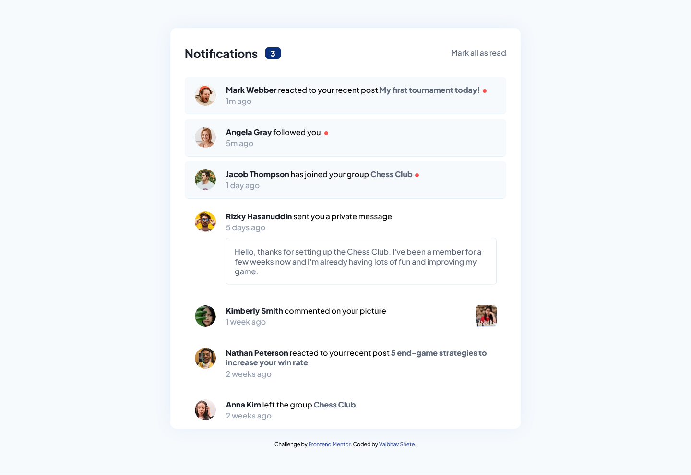

# Frontend Mentor - Notifications page solution

This is a solution to the [Notifications page challenge on Frontend Mentor](https://www.frontendmentor.io/challenges/notifications-page-DqK5QAmKbC). Frontend Mentor challenges help you improve your coding skills by building realistic projects. 

## Table of contents

- [Overview](#overview)
  - [The challenge](#the-challenge)
  - [Screenshot](#screenshot)
  - [Links](#links)
- [My process](#my-process)
  - [Built with](#built-with)
  - [What I learned](#what-i-learned)
  - [Continued development](#continued-development)
  - [Useful resources](#useful-resources)
- [Author](#author)

## Overview

### The challenge

Users should be able to:

- Distinguish between "unread" and "read" notifications
- Select "Mark all as read" to toggle the visual state of the unread notifications and set the number of unread messages to zero
- View the optimal layout for the interface depending on their device's screen size
- See hover and focus states for all interactive elements on the page

### Screenshot

### Links

- Solution URL: [on Github](https://github.com/vaibhavbshete/frontend-mentor-challenges/tree/main/notifications-panel)
- Live Site URL: [on Github Pages](https://your-live-site-url.com)

## My process

### Built with

- Semantic HTML5 markup
- Mobile-first workflow
- [Vue](https://vuejs.org/) - JS Framework
- [Sass](https://sass-lang.com/) - For CSS
- [Webpack](https://webpack.js.org) - For bundling everything for the browser

### What I learned

I have been using [laravel-mix](laravel-mix.com/) up until now for setting up the project. It would take care of vue, tailwind and whatever preprocessing I needed. And laravel-mix assures its utility by being ready for as many front-end resources as possible. I knew it is a wrapper around [webpack](https://webpack.js.org) itself. And I wanted to know how much less of a setup is needed if I do not use laravel-mix. So I decided to use webpack directly, without the help of laravel-mix. Of course, where needed, I have peeked into laravel-mix's source code as well. But now I believe I can set up a webpack project by myself.

Also as always suggested by frontendmentor, I decided to try [sass](https://sass-lang.com/) for css. VSCode does not show the colour decorators (preview and picker) and out-of-the-box, so I fiddled with some plugins, but none was satisfactory. I later learned that VSCode supports colour decorators in scss! Maybe because sass itself doen't validate as css before compilation, there must be a lot more coding required to support colour decorators in a different language altogether. Will try scss next time.

### Continued development

I wish to write a workflow for each of my frontend mentor projects and make it such that only that project's output is triggered by updates to that project's folder

### Useful resources

- [createapp.dev](https://createapp.dev/webpack/vue) - Helps with the scary webpack configurations.
- [Webpack Concepts](https://webpack.js.org/concepts/) - If you are new to webpack, this is a good place to start.

## Author

- Website - [Vaibhav Shete](https://vaibhavbshete.github.io)
- Frontend Mentor - [@vaibhavbshete](https://www.frontendmentor.io/profile/vaibhavbshete)
- Twitter - [@vaibhavbshete](https://www.twitter.com/vaibhavbshete)

