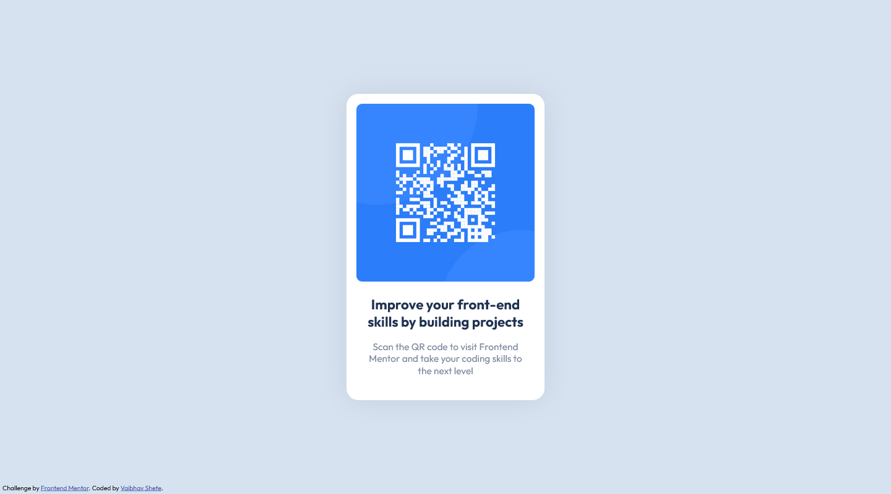

# Frontend Mentor - QR code component solution

This is a solution to the [QR code component challenge on Frontend Mentor](https://www.frontendmentor.io/challenges/qr-code-component-iux_sIO_H). Frontend Mentor challenges help you improve your coding skills by building realistic projects. 

## Table of contents

- [Overview](#overview)
  - [Screenshot](#screenshot)
  - [Links](#links)
- [My process](#my-process)
  - [Built with](#built-with)
  - [What I learned](#what-i-learned)
  - [Continued development](#continued-development)
  - [Useful resources](#useful-resources)
- [Author](#author)

## Overview

### Screenshot

### Links

- Solution URL: [Github Repo Folder](https://github.com/vaibhavbshete/frontend-mentor-challenges/tree/main/qr-code-component)
- Live Site URL: [View on Github Pages](https://vaibhavbshete.github.io/frontend-mentor-challenges/qr-code-component)

## My process

### Built with

- Semantic HTML5 markup
- CSS custom properties
- Flexbox

### What I learned

Working from a pre-rendered design for the first time. It felt good because I didn't have to figure out the colours myself.
I haven't used media queries in the CSS, but have kept it from spilling out of the screen on small screens.

### Continued development

Would improve upon the sizings once I figure out if there is a better option than pixels.

### Useful resources

- [font-size | MDN Docs](https://developer.mozilla.org/en-US/docs/Web/CSS/font-size) - This helped me with font sizes in pixels. Extensive article explaining all units and their meanings.

## Author

- Frontend Mentor - [@vaibhavbshete](https://www.frontendmentor.io/profile/vaibhavbshete)
- Twitter - [@vaibhavbshete](https://www.twitter.com/vaibhavbshete)
